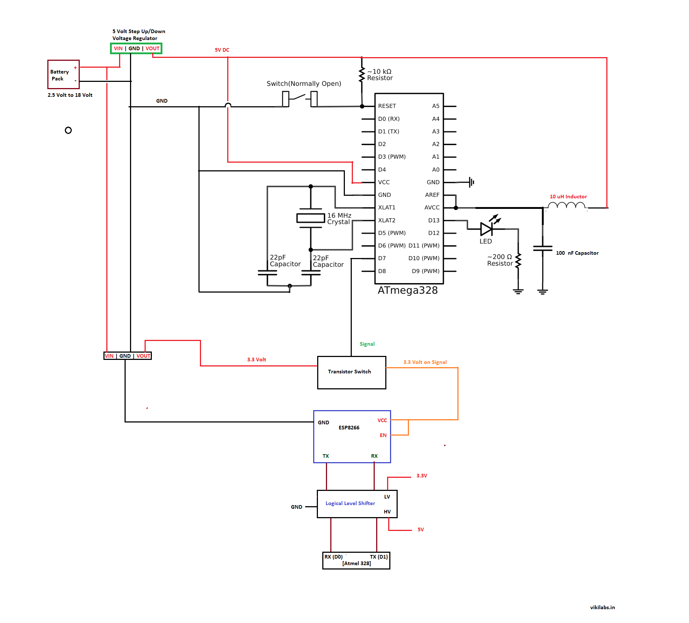

# Irrigation Monitoring System 

This software is written for multi sensor device targeted for autonomous farming. The device is capable of monitoring soil temperature, air humidity, soil conductivity, soil pH values and pump the aggrigated data to the cloud using WiFi. 

For more details check https://vikilabs.org
